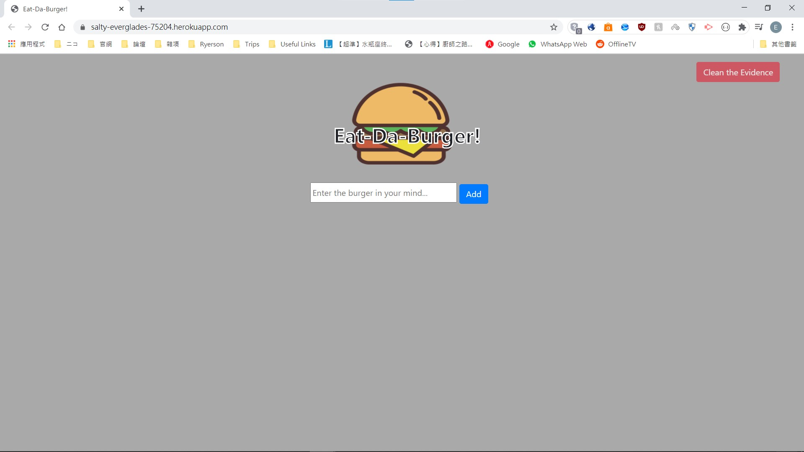
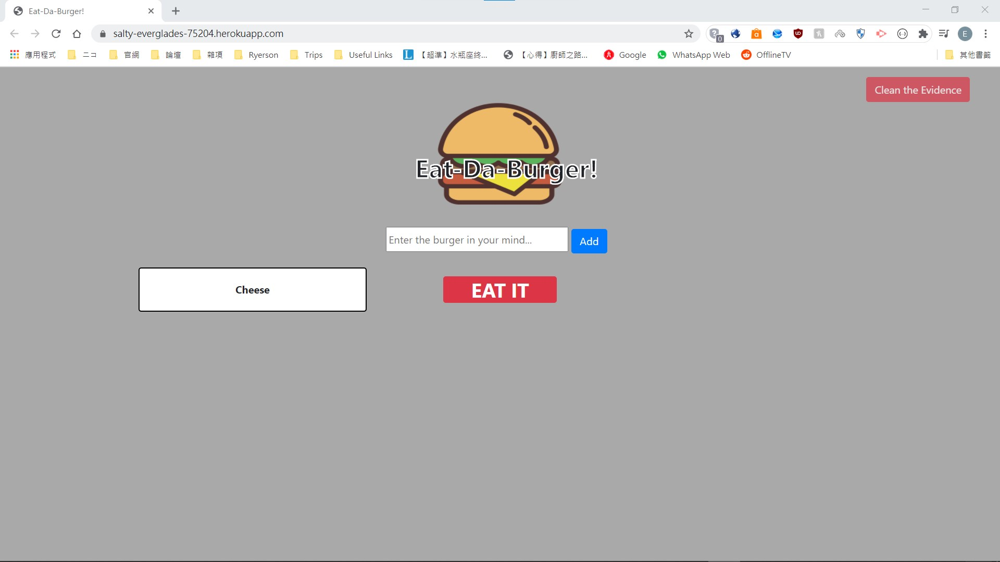
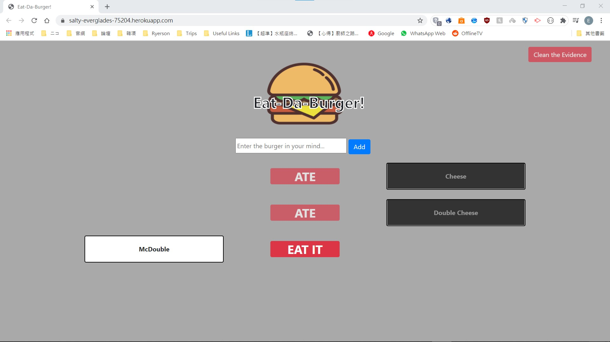

# Burger-Logger
Goal: To make an webapp for users to input the names of the burgers they want to eat 
This project has the following abilities:
- Able to display all entries of the database with appropriate states
    - Display the names of the burgers as individual rows
    - Display differently accoording to their states,  i.e. eaten or not
- Able to send a POST request to the database when the user pressed enter in input box or pressed the "Add" button
- Able to send a PUT request to the database when the user has "eaten" a burger of their choice
- Able to send a DELETE request to the database when the "Clean the evidence" button is pressed
- Able to retieve all entries from the database by sending a GET request to the database when the page is loaded/reloaded

 

This project used MVC model and contains the following files:
- connection.js: contains settings for connecting to the database
- orm.js: general orm, which contains all SQL queries that will be used in the app
- db folder: contains SQL codes for creating a database to work with the app
- models/burger.js: specific orm, which specify what SQL queries are needed for this object
- public folder: contains style.css and burgers.js for styling the app's page and managing events caused by user
- routes/api_routes.js: contains API calls to work with burger.js
- views folder: contains HTML files written with *Handlebars* to build the app's page without the use of JavaScript
- package.json: contains general info on the app as well as all packages used in the app
- server.js: setting up the server for API calls as well as serving the static page from *views* folder

 

This project was made using **HTML5**, **CSS**, **Bootstrap**, **JavaScript**, **jQuery**, **Node.js**, **Express.js**, **Handlebars** and **MySQL** 
This project is currently hosted on heroku with the use of JAWSDB: https://salty-everglades-75204.herokuapp.com/  

 

## The WebApp

### New Entry
- Either press "Enter" or the "Add" button to add more burgers to the database

### Ate a Burger
- To eat the burger, press the "EAT IT" button

### To clear the list...
- There is a "Clean the evidence" button at the top right, which will *DELETE* all entries in the database